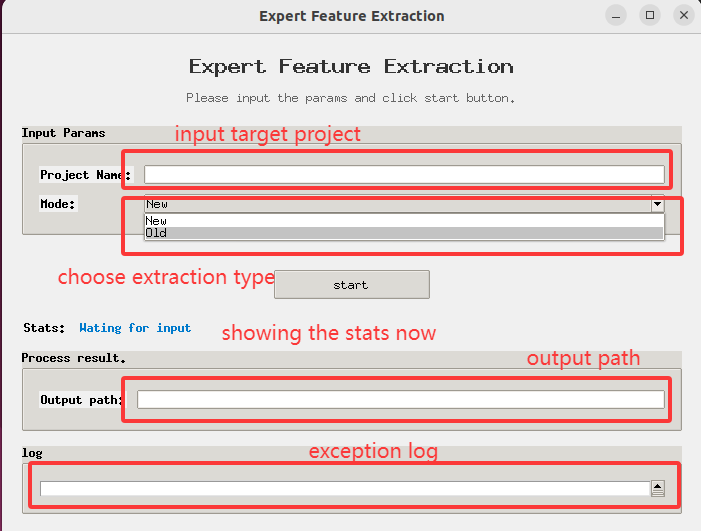
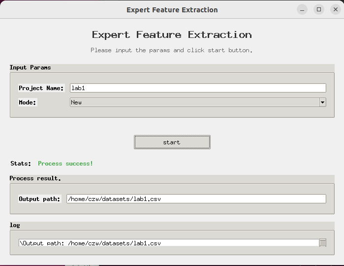
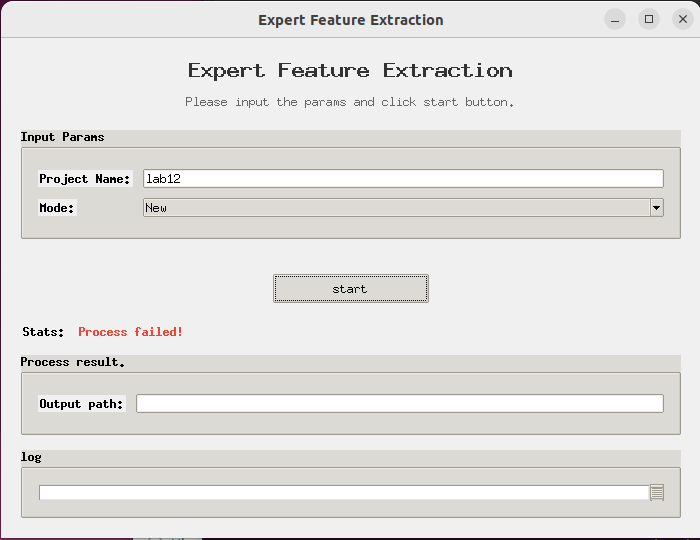

CommitGuru - Improved
==========================================

Ingests and analyzes code repositories.

==> This tool is improved based on tool Commit Guru, which improved the feature extraction part.


## Installation
1. Clone this repository in to an empty directory
2. Check and modify `./config.json`, especially the database config.

Db: information relating to your postgresql database setup
logging: information about how to write logging information
gmail: gmail account to be used to send cas notifications
repoUpdates: how often repositories should be updated for new commits
system: how many worker threads the cas system can use to analyze and ingest repos.

### Dependencies
make share you are running in **Linux**
Additional Instructions are available in SETUP.md
* Python  >= 3.3 and <= 3.6
* Pip for Python Version > 3.3 and < 3.6
* Git > 1.7
* R
* python-dev
* rpy2
* requests
* dateutil
* sqlalchemy
* py-postgresql
* GNU grep
* MonthDelta


### Installing rpy2

```
pip install rpy2
```

### Additional Pip Packages
Install the following packages by doing `pip install `  and then the package
name. Make sure you are using python3, such as using a virtualenv if using Ubuntu.

* SQL Alchemy (sqlalchemy)
* psycopg2
* requests (requests)
* python-dateutil (python-dateutil)
* any package the runtime pip prompts you that are missing.

To install the MonthDelta package, simply do: `pip install https://pypi.python.org/packages/source/M/MonthDelta/MonthDelta-1.0b.tar.bz2`

### Attetion
make sure that this project need the dataset tool PostgreSQL

### First-Time Database Setup
Set up the database for the first time by running `python script.py initDb`

## Usage
In a terminal, type `nohup python script.py & ' to start the code repo analyzer and run it in the background.

## OFFLine
Update by Zuowei Chen 2024-10-28
I have found if we once use the script.py to extract datasets, everytime it will use **git clone** to clone the project. However, the clone process may be interrupted due to the network problem and we need restart this tool again, which is very hassle and waste of time, so I have integrates a offline version of this tool, the usage can be seen below:

### Base
```
python script.py initDb
python create_repositories.py {project_name} {url} #In offline version, {url} can be any string since we do not use it.
python offline.py {project_name}#make sure that we have already clone the project to ./CASRepos/git/
```

### Mode

```
python offline.py {project_name} {Mode} #Mode can be chosen from "New" and "Old". "New" is our method and "Old" is the original Commit Guru (Chronological order). You can not input param 'Mode' and it will run default mode "Old". 
```

## GUI
This feature was added in version 2.0. This is an extension of the offline mode.
```
python runGUI.py
```

### GUI display

* Project Name: The target project, make sure you have cloned it to `CASRepos/git/`.
* Mode: `NEW` means BDFE and `Old` means simple chronological order.
* start: If you have prepared the params above, click it and start.
* Output path: The data will be extracted to this path.

### Success


### Error
